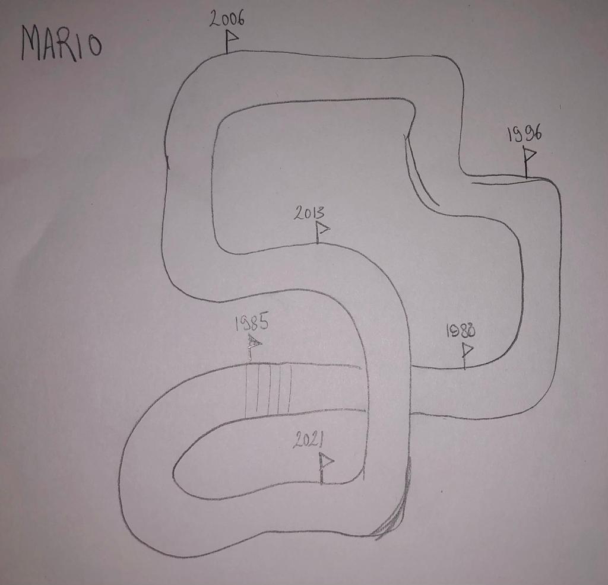
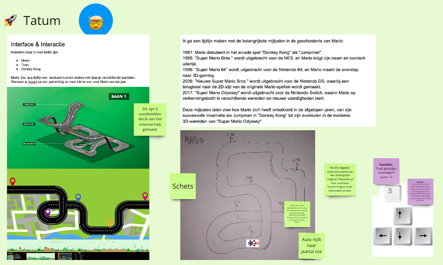
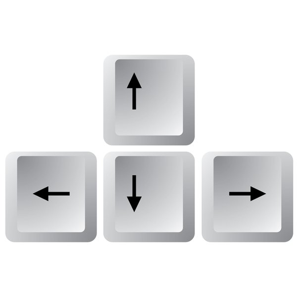
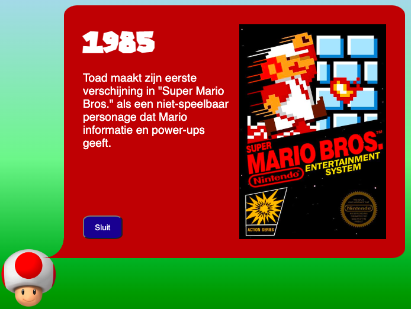
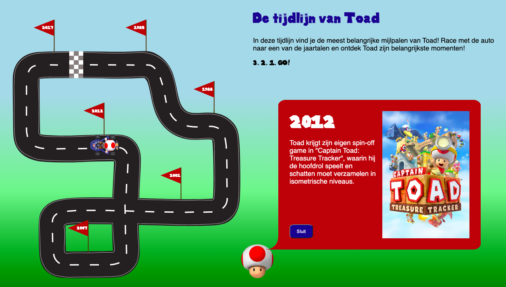
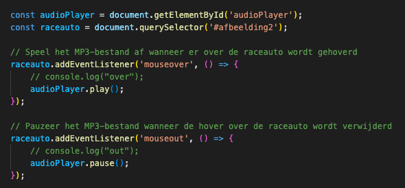
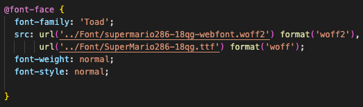
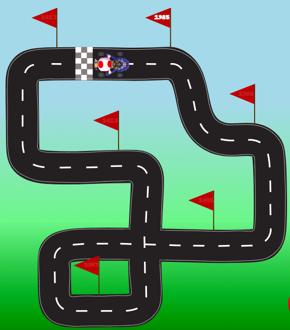

# Procesverslag
Markdown is een simpele manier om HTML te schrijven.  
Markdown cheat cheet: [Hulp bij het schrijven van Markdown](https://github.com/adam-p/markdown-here/wiki/Markdown-Cheatsheet).

Nb. De standaardstructuur en de spartaanse opmaak van de README.md zijn helemaal prima. Het gaat om de inhoud van je procesverslag. Besteedt de tijd voor pracht en praal aan je website.

Nb. Door *open* toe te voegen aan een *details* element kun je deze standaard open zetten. Fijn om dat steeds voor de relevante stuk(ken) te doen.

## Jij

### Ontwerper:
Tatum Loggere

#### Je startniveau:
Hemelsblauw

# Je plan

  
De eerste versie/schets van je ontwerp & je persoonlijke uitdaging

  ### De eerste versie/schets:
  Ik heb een eerste schets gemaakt van mijn eventuele idee voor de opdracht. Het is een racebaan met daarop vlaggetjes met een jaartal. In elk jaartal bevindt een belangrijke mijlpaal van Toad zijn evolutie:
  

  ### Je ambitie: 
  Aan deze technieken/punten wil ik werken:
  - Zoveel mogelijk leren over html en css
  - Mezelf uitdagen om een stapje verder te gaan
  - Niet bang zijn om vragen te stellen wanneer nodig
  - Een leuke animatie maken
 

## Voortgang/Feedback 1

  
Danielle heeft mij feedback gegeven en dit zijn de bevindingen uit ons gesprek:

  ### Bevinding 1:

  
  Dit is een afbeelding uit het miro bord waar ik mijn eerste ideeen heb geplaatst. Hier ben ik met Danielle doorheen gegaan en ze vond het idee duidelijk en leuk. Ze vond wel dat het nog simpel was en dat er nog veel toegevoegd kon worden.

  #### oplossing:
  
  Idee verder uitwerken en nadenken hoe ik de informatie van de jaartalen kan weergeven. 

  ### Bevinding 2:
  Sounds zouden een leuke toevoeging kunnen zijn. 

  #### oplossing:
  Dit was mij vrij snel gelukt door het te googelen. Ik heb van een liedje een mp3 gemaakt en dit gelinkt aan een afbeelding. 

  ### Bevinding 3:
  Zou leuk zijn om de auto op de racebaan te besturen met knopjes zoals hieronder getoond.
  

  #### oplossing:
  Dit heb ik uiteindelijk niet gedaan maar er is wel de mogelijkheid op de raceauto te laten rijden.

  ### Bevinding 4:
  Op de schets is de racebaan nog een beetje saai en zou iets duidelijker kunnen.

  #### oplossing:
  Ik heb van de schets een digitaal ontwerp gemaakt in ilustrator, hiebrij heb ik witte lijntjes toegevoed en een duidelijke startlijn gemaakt. Met deze details is het nog duidelijker dat het om een racebaan gaat.

  ### Bevinding 5:
  We waren het beide eens dat Toad een leuker en orgineler karakter is dan Mario.

  #### oplossing:
  Ik heb Toad gebruikt als karakter voor de opdracht. 

## Voortgang/Feedback 2

  
Jaime heeft mij feedback gegeven en dit zijn de bevindingen uit ons gesprek:

  
  ### Bevinding 1:
  Jaime zei dat info box op een creatievere manier getoond kon worden.

  #### oplossing:
  Dit heb ik gedaan door er een tekstbox van te maken en een hoofd van Toad toe te voegen waardoor het lijkt dat Toad zelf alle informatie verteld. Ook heb ik bij elk tekstboxje een afbeelding toe gevoegd.
  

  ### Bevinding 2:
  Code is soms niet helemaal duidelijk waar het over gaat.

  #### oplossing:
  Ik heb zoveel mogelijk comments toe gevoegd om het zo duidelijk mogelijk te maken. Ook voor mezelf is dit heel fijn omdat je hierdoor alles makkelijk terug kan vinden. 

  ### Bevinding 3:
  Jaime vond het idee van de raceauto die naar de jaartalen toe rijdt erg leuk.
 
  #### oplossing:
  Dit heb ik uitgewerkt en de raceauto kan nu rijden.

  ### Bevinding 4:
  Jaime vond de achtergrond iets te saai en adviseerde om deze eventueel nog aan te passen.
  
  #### oplossing:
  Ik heb de achtergrond gelaten zoals het is want ik vond deze wel mooi en wil niet een te opvallende achtergrond aangezien de focus daar niet op ligt. 

  ### Bevinding 5:
  Github link werkte niet.
  
  #### oplossing:
  Hier heb ik later naar gekeken en deze werkt nu wel. 

## Voortgang/Feedback 3/Test

  
Isabelle heeft mij feedback gegeven en dit zijn de bevindingen uit ons gesprek/test:

  De opdracht is af maar heb voor een laatste keer feedback gekregen ook om te testen of alles werkt en duidelijk is. 
  
  ### Bevinding 1:
  Github link werkte niet. Het had blijkbaar even tijd nodig voor github om te laden en de link werkte na een tijdje wel.

  ### Bevinding 2:
  Het was meteen duidelijk voor Isabelle waar het over ging

  ### Bevinding 3:
  Ze had begreep dat de jaartallen klikbaar waren en dat hierdoor de auto naar het jaartal reed
 
  ### Bevinding 4:
  Je kan tappen op de jaartalen en ook op enter klikken zodat de auto gaat rijden. Dit kan dus zowel met de muis als met het toetsenbord. 

  ### Bevinding 5:
  De website is responsive en de teksten hebben voldoende contrast met de achtergrond.

  ### Bevinding 6:
  De fonts worden correct getoond via github op een andere computer
  

## Reflectie

  
Mijn eindresultaat & persoonlijke ontwikkeling

  ### Je uitkomst - karakteristiek screenshot(s):
  

  ### Dit ging goed/Heb ik geleerd: 

  

  Het toevoegen van een sound ging vrij eenvoudig. Met behulp van mijn klasgenoten heb ik dit kunnen doen. 

  

  Ook het toevoegen van het font ging goed. In het begin veranderde er niks en dit kwam omdat het niet goed verwees naar het mapje van de font. Dit heb ik dus vrij snel kunnen oplossen. 

  ### Dit was lastig/Is niet gelukt:
  
  
  Wat ik het lastigste vond van de hele opdracht was het maken van de animatie (De auto laten rijden naar de jaartalen). Dit was voor mij de eerste keer dus maakte me hier wel een beetje zorgen om. Met hulp van Sanne is dit uiteindelijk gelukt en is dit ook het deel waar ik het meest trots op ben aangezien ik eerst dacht dat het me niet ging lukken. 
  Verder had ik weinig ervaring met het maken van een grid, dit ging ook niet in 1 keer goed maar wanneer Sanne dit uitlegde is het wel meteen duidelijk en begrijp ik ook hoe ik de grid heb gemaakt. 

## Bronnenlijst

Deze bronnen heb ik gebruikt tijdens de opdracht

1. Bron Afbeelding race auto: https://free3d.com/nl/3d-model/mario-kart-tour-toad-pipe-frame-model-4754.html
2. Bron Lettertype: https://www.fontspace.com/super-mario-286-font-f22053
3. Bron Sound: https://www.youtube.com/watch?v=jDwVkXVHIqg&feature=youtu.be
4. Bron Afbeelding Toads hoofd: https://www.pngegg.com/en/png-wanwk
5. Bron @fontface code: https://css-tricks.com/snippets/css/using-font-face-in-css/
6. Brond Afbeeldingen van de 6 games: https://www.imdb.com/list/ls048649375/

